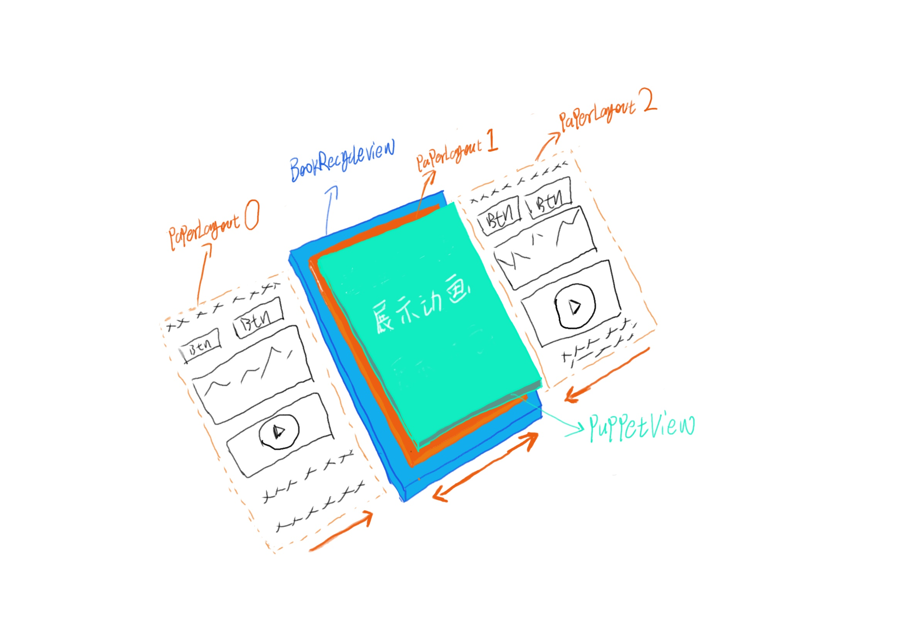

# 介绍


* app module：阅读器demo
* gpu_test module：上图纯色demo，作为独立的仿真动画实现最小demo，就一个类，包含完整的仿真动画算法与标点
# 已知问题反馈
提供一种阅读器的实现思路,注意是实现思路不是完整的解决方案。一些反馈的问题我会先记录在这里，最近忙完了我会更新。
在这之前欢迎提PR处理

* 内存增长问题,可通过增加bitmap缓存解决。bitmap创建的代码位置：2023-10-29 添加缓存策略

```java
BookRecyclerView.printViewToBitmap()
```

# 实现思路介绍

采用木偶View将渲染， Paper页面布局、事件、动画完全分离。PaperLayout继承成自LinearLayout，
支持放入图片，视频等元素，但完全无需关心翻页动画的渲染。（不包含文字的处理，以后应该也不会添加）

https://user-images.githubusercontent.com/13959965/230751166-a72e1f4b-317b-47a7-aa1c-bbc70ca34f13.mp4

核心类就4个，它们的职责跟它们的名字很相近。

* BookView 摆放 RecyclerView 与 PuppetView
* BookRecyclerView 作为底层容器，接受滑动事件，完成页面更换，接管无动画的事件
* PaperLayout 作为页面卡片根布局，也就是设置给 RecyclerView.Adapter 加载的布局，接管仿真动画与覆盖动画的事件
* PuppetView 本身不处理任何事件,只是展示动画

## 手绘一张图，呈现实现原理

> 如果用文字来阐述原理难免要长篇大论，何况这里涉及到Z轴View堆叠，借此机会展示下我的绘画能力吧🐶（瞎搞）



