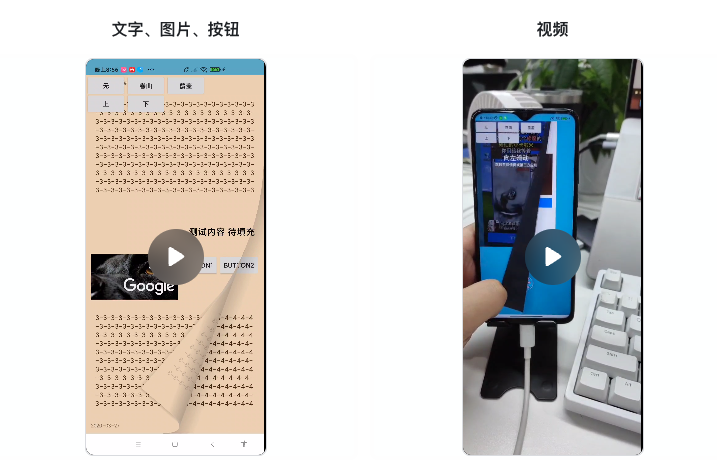

# 介绍

提供一种阅读器的实现思路，基于RecyclerView，只需将PaperLayout作为Item根布局即可。

采用木偶View将渲染， Paper页面布局、事件、动画完全分离。PaperLayout继承成自LinearLayout，
支持放入图片，视频等元素，但完全无需关心翻页动画的渲染。（不包含文字的处理，以后应该也不会添加）

# 实现思路介绍

核心类就4个，它们的职责跟它们的名字很相近。

* BookView 摆放 RecyclerView 与PuppetView
* RecyclerView 作为底层容器，接受滑动事件，完成页面更换与事件分配
* PaperLayout 作为页面卡片根布局，也就是设置给RecyclerView.Adapter加载的布局
* PuppetView 本身不处理任何事件,只是展示动画

## 手绘一张图，呈现实现原理

> 如果用文字来阐述原理难免要长篇大论，何况这里涉及到Z轴View堆叠，借此机会展示下我的绘画能力吧🐶（瞎搞）

